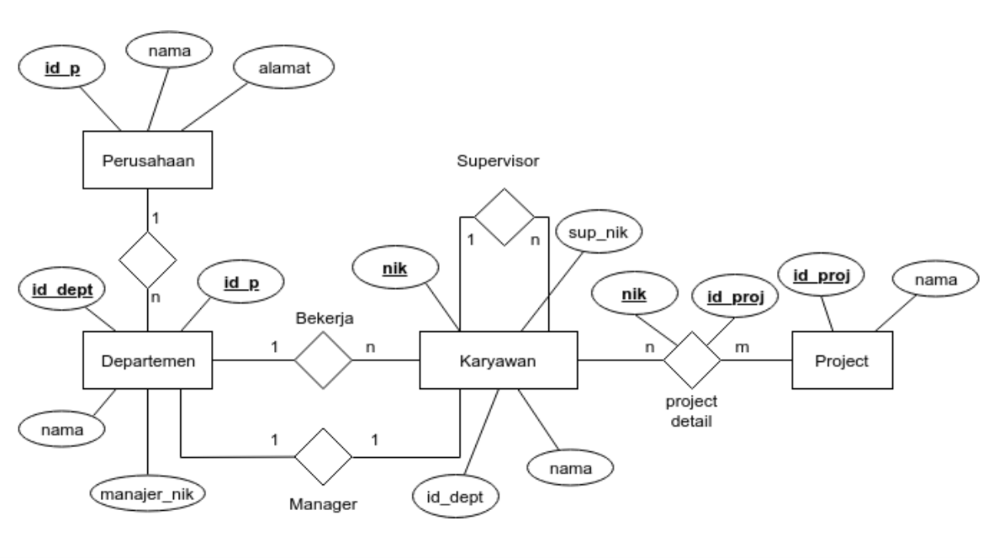
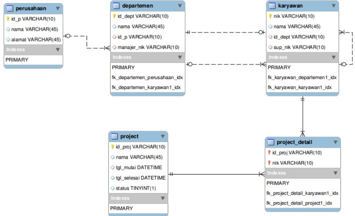
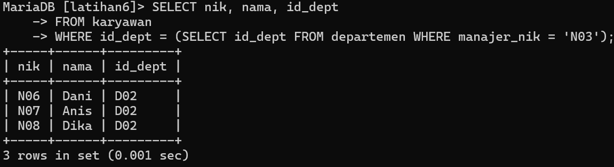
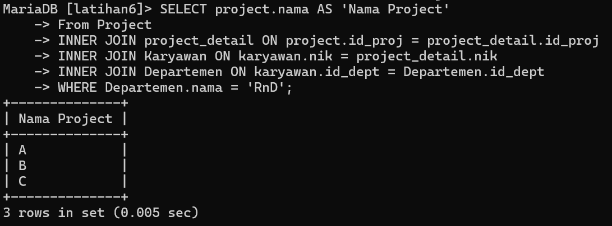
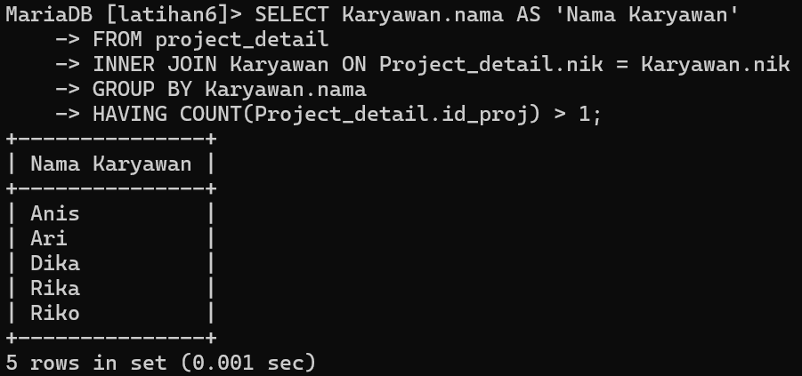
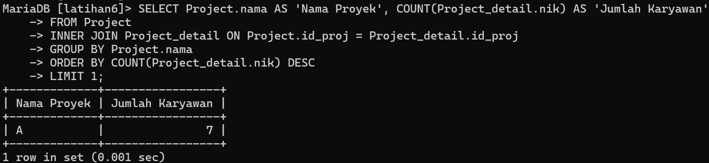
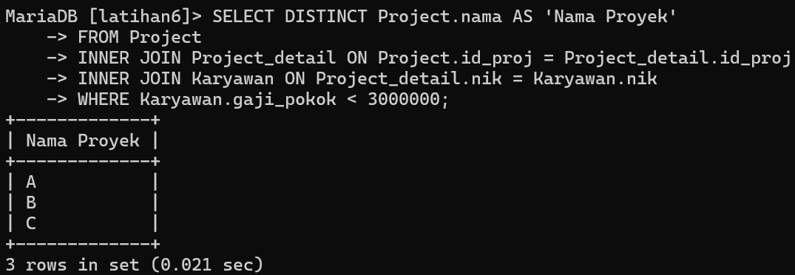

# UAS { Pertemuan ke 16 } 


## Profil
| Variable | Isi |
| -------- | --- |
| **Nama** | Muhammad Nurul Firdaus |
| **NIM** | 312310495 |
| **Kelas** | TI.23.A5 |
| **Mata Kuliah** | Basis data |

# ER-D


# Input Data


# Soal latihan praktikum 7
Berdasarkan ERD dan Sampel Data diatas buatlah Query SQL untuk:
1. Menampilkan Nama Karyawan yang Berada di Departemen yang Dipimpin oleh Manajer dengan Nama 'Rika'
2. Menampilkan Nama Proyek yang dikerjakan oleh Karyawan dari Departemen 'RnD'
3. Menampilkan Nama Karyawan yang Terlibat dalam Lebih dari Satu Proyek
4. Menampilkan Nama Proyek yang melibatkan Karyawan terbanyak.
5. Menampilkan Nama Proyek yang Diikuti oleh Karyawan dengan Gaji Pokok Kurang dari 3 Juta

### 1. Menampilkan Nama Karyawan yang Berada di Departemen yang Dipimpin oleh Manajer dengan Nama 'Rika'
**Script :**

```
SELECT nik, nama, id_dept
FROM karyawan
WHERE id_dept = (SELECT id_dept FROM departemen WHERE manajer_nik = 'N03');
```

**Output :**



### 2. Menampilkan Nama Proyek yang dikerjakan oleh Karyawan dari Departemen 'RnD'
**Script :**

```
SELECT project.nama AS 'Nama Project'
From Project
INNER JOIN project_detail ON project.id_proj = project_detail.id_proj
INNER JOIN Karyawan ON karyawan.nik = project_detail.nik
INNER JOIN Departemen ON karyawan.id_dept = Departemen.id_dept
WHERE Departemen.nama = 'RnD';
```

**Output :**



### 3. Menampilkan Nama Karyawan yang Terlibat dalam Lebih dari Satu Proyek
**Script :**

```
SELECT Karyawan.nama AS 'Nama Karyawan'
FROM project_detail
INNER JOIN Karyawan ON Project_detail.nik = Karyawan.nik
GROUP BY Karyawan.nama
HAVING COUNT(Project_detail.id_proj) > 1;
```

**Output :**



### 4. Menampilkan Nama Proyek yang melibatkan Karyawan terbanyak.
**Script :**

```
SELECT Project.nama AS 'Nama Proyek', COUNT(Project_detail.nik) AS 'Jumlah Karyawan'
FROM Project
INNER JOIN Project_detail ON Project.id_proj = Project_detail.id_proj
GROUP BY Project.nama
ORDER BY COUNT(Project_detail.nik) DESC
LIMIT 1;
```

**Output :**



### 5. Menampilkan Nama Proyek yang Diikuti oleh Karyawan dengan Gaji Pokok Kurang dari 3 Juta
**Script :**

```
SELECT DISTINCT Project.nama AS 'Nama Proyek'
FROM Project
INNER JOIN Project_detail ON Project.id_proj = Project_detail.id_proj
INNER JOIN Karyawan ON Project_detail.nik = Karyawan.nik
WHERE Karyawan.gaji_pokok < 3000000;
```

**Output :**

